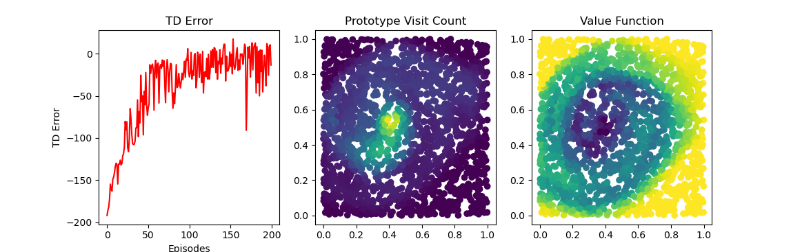

# Kanerva Coding
Kanerva Coding (KC) is a way of representing values of a vector of continous variables (AKA Function Approximation). It does this by storing the position of stationary prototypes in the continuous space and representing a new data point as the indicies of nearby prototypes. This repo deviates from the original implementation of Kanerva Coding. The original approach involved binary input spaces of large dimension whereas this repository focuses on continuous spaces.

Running main.py will train a Q learning agent with elegability traces on Mountain car and output the following plots. First is the TD error each episode. The following 2 plots are the visitation count and the value function (the average Q value from the agent) for each prototype. Note that the prototypes are in a normalized space.

## Requirements
- numpy
- matplotlib
- gym

